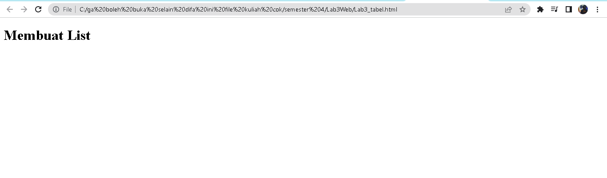
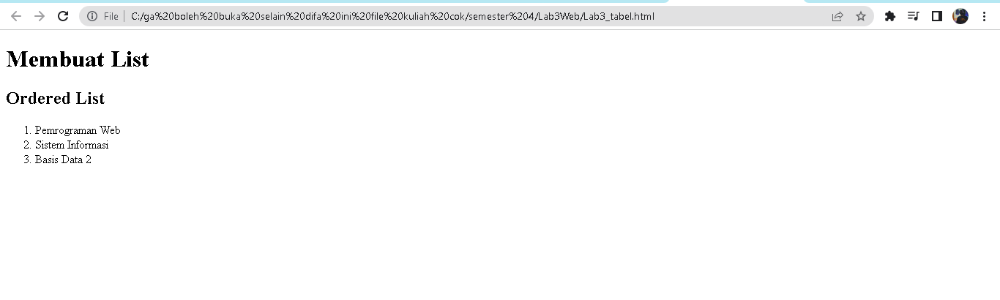
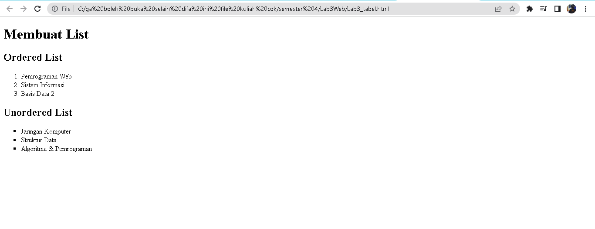
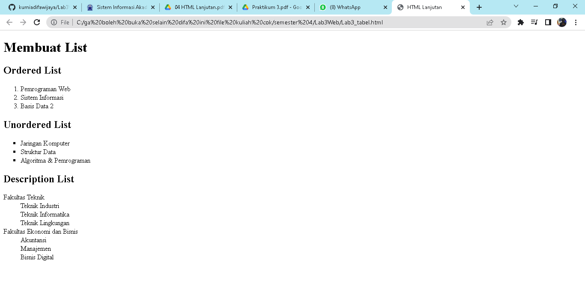
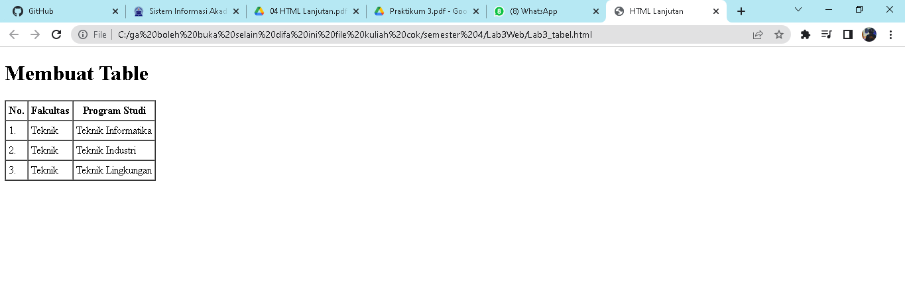
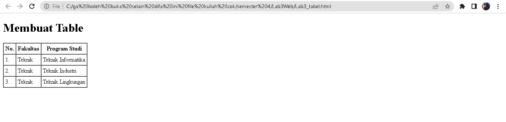
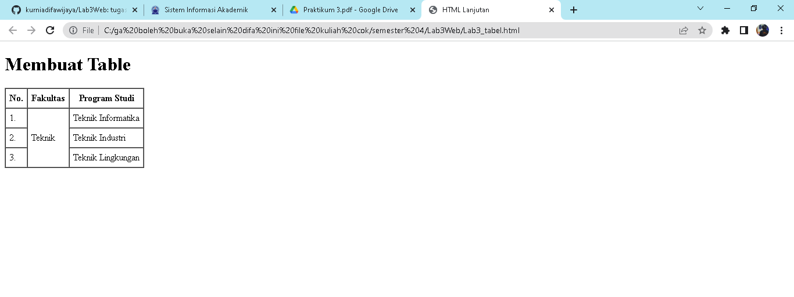
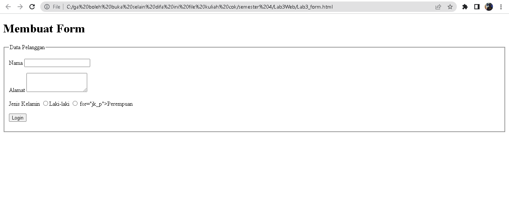
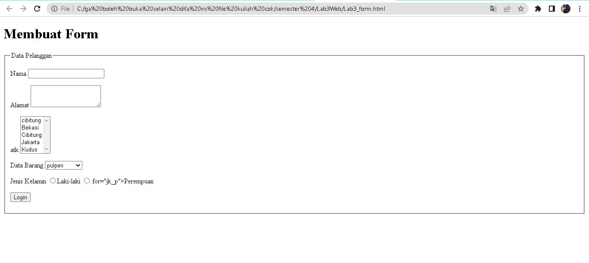

# Lab3Web
tugas praktikum 3 

**NAMA : Kurnia Difa Wijaya** 
**KELAS : TI 20 B 01** 
**NIM : 312010024**

1.**MEMBUAT LIST HTML**

pada pertemuan kali ini saya akan membuat list tabel

2.**order list**

langkah ke dua kita masukan order list

3.**unorder list**

selanjutnya kita membuat unorder list

4.**Membuat Description List**

selanjutnya kita membuat Membuat Description List

* **membuat tabel**

selanjutnya kita membuat tabel

selanjutnya Mengatur Margin dan Padding

* **menggabungkan sel data**

selanjutnya kita menggabungkan sel data

5. **Membuat Form**

selanjutnya kita membuat form

* **jawaban**

berikut form yang telah di edit

